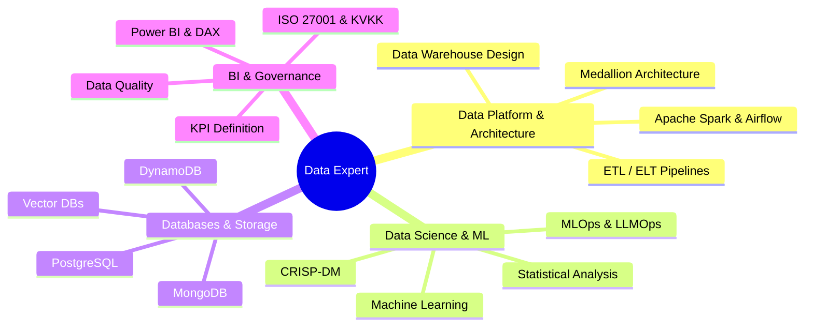

<div align="center">

# Gökhan Elbistan
### Senior Data Scientist • Data Platform Lead • Product Owner

<p>
  
  
  
</p>

> *"I live with data, for data — because everything is about data."*


</div>

---

## 🎯 Core Competencies



---

## 👤 Profile

Senior Data Scientist with organization-wide ownership of analytics, data platform modernization, and enterprise data architecture in logistics and supply chain. Experienced in Medallion Architecture, scalable BI ecosystems, ERP integrations, and cross-functional team leadership. Focused on architecture-driven data operating models that enable measurable, future-ready decision-making.

---

## 🛠️ Tech Stack

### Core Data Platform & Architecture


### Databases & Storage


### Data Science & ML


### MLOps & Observability


### BI & Decision Systems


### Data Governance


---

## 📁 Project Structure Philosophy

```
project_name/
├── data/               # DVC-tracked, git-ignored
│   ├── raw/           # Immutable source data
│   ├── processed/     # Cleaned & transformed
│   └── features/      # Feature engineering outputs
├── notebooks/         # EDA & experimentation
├── src/               # Production source code
│   ├── data/
│   ├── features/
│   ├── models/
│   └── visualization/
├── tests/
├── configs/
├── monitoring/        # Grafana dashboards & alerts
├── deployment/        # Docker, cloud configs
└── docker-compose.yml
```

*Template of choice: [cookiecutter-data-science](https://github.com/drivendataorg/cookiecutter-data-science) by @drivendataorg*

---

## 📊 GitHub Stats

<p align="center">
  
  
</p>

---

## 🤝 Connect

<div align="center">
  <a href="https://linkedin.com/in/gkhnelbstn">
    
  </a>
  <a href="https://kaggle.com/gkhnelbstn">
    
  </a>
  <a href="https://huggingface.co/gkhnelbstn">
    
  </a>
  <a href="https://osf.io/gkhnelbstn">
    
  </a>
  <a href="mailto:gkhnelbstn@gmail.com">
    
  </a>
</div>

<div align="center">
  <sub>✨ Always learning, always building, always optimizing ✨</sub>
  <br/>
  
</div>
