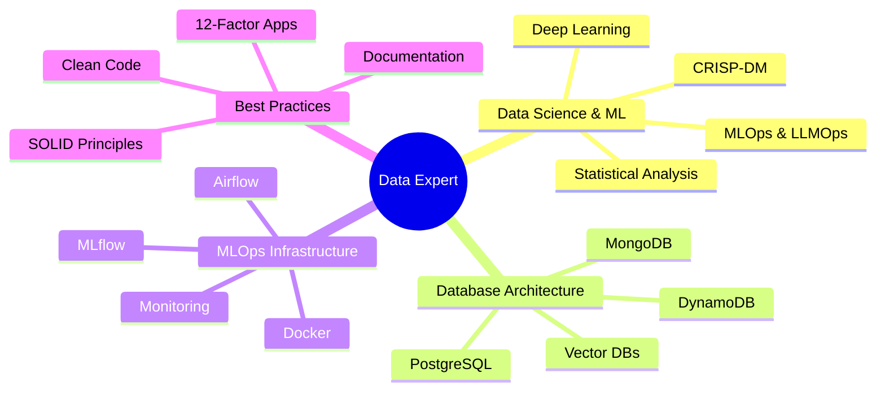

<div align="center">
  
# Gökhan Elbistan 👨‍💻
### Data Scientist • MLOps Engineer • Database Architect

<p>
  
  
  
</p>

> *"I live with data, for data — because everything is about data."*


## 🎯 Core Competencies



## 💾 Database Architecture & Management

<details>
<summary><b>Primary Databases</b></summary>
<br>

| Category | Technologies & Expertise |
|----------|-------------|
| **Relational** |  -CC2927?style=flat-square&logo=microsoft-sql-server) |
| **NoSQL** |   |
| **Vector** |   |
| **Cache/Queue** |  |
| **Data Warehouses** |    |

</details>

<details>
<summary><b>Database Tools & Management</b></summary>
<br>

| Category | Tools |
|----------|-------------|
| **Primary UI Tools** |   |
| **Management Tools** |   |
| **Cloud Management** |   |
| **CLI Tools** |   |

</details>

<details>
<summary><b>Learning & Exploration</b></summary>
<br>

| Category | Technologies |
|----------|-------------|
| **Time Series** |   |
| **Graph** |  |
| **Search & Analytics** |   |
| **Distributed** |   |

*Database selection is always problem-driven! Primarily focused on data science and analytics use cases.*

</details>

## 📊 Data Science & Analytics Stack

<details>
<summary><b>Data Processing & Analysis</b></summary>
<br>

| Category | Technologies |
|----------|-------------|
| **Core Processing** |     |
| **Big Data** |    |
| **Machine Learning** |    |
| **Deep Learning** |   |
| **Statistical Analysis** |    |
| **Time Series** |   |
| **Survival Analysis** |  |

</details>

<details>
<summary><b>Data Visualization & Applications</b></summary>
<br>

| Category | Technologies |
|----------|-------------|
| **Interactive Viz** |   |
| **Web Applications** |   |
| **Static Plotting** |   |
| **Business Intelligence** |   |

</details>

## 🛠️ MLOps & Infrastructure

<details>
<summary><b>Model Development & Experimentation</b></summary>
<br>

| Category | Technologies & Status |
|----------|-------------|
| **Experiment Tracking** |   |
| **Hyperparameter Tuning** |   |
| **Version Control** |   |
| **Model Registry** |  |

</details>

<details>
<summary><b>Deployment & Serving</b></summary>
<br>

| Category | Technologies & Status |
|----------|-------------|
| **API Development** |    |
| **Containerization** |   |
| **Model Serving** |   |
| **Cloud Deployment** |    |

</details>

<details>
<summary><b>LLMOps & AI Infrastructure</b></summary>
<br>

| Category | Technologies & Status |
|----------|-------------|
| **LLM Monitoring** |   |
| **LLM Frameworks** |   |
| **Vector Databases** |   |
| **Model Hosting** |   |

</details>

<details>
<summary><b>Monitoring & Observability</b></summary>
<br>

| Category | Technologies & Status |
|----------|-------------|
| **Metrics & Dashboards** |   |
| **System Monitoring** |   |
| **Application Monitoring** |   |
| **Tracing** |   |
| **Alerting** |   |

</details>

<details>
<summary><b>Workflow Orchestration</b></summary>
<br>

| Category | Technologies & Status |
|----------|-------------|
| **Primary Orchestrator** |  |
| **Learning/Exploring** |   |
| **Low-Code Solutions** |   |
| **Schedulers** |   |

</details>

## ☁️ Cloud & Infrastructure

<details>
<summary><b>Cloud Platforms</b></summary>
<br>

| Category | Technologies & Status |
|----------|-------------|
| **Primary Cloud** |  |
| **Secondary Cloud** |  |
| **Self-Hosted** |   |

</details>

<details>
<summary><b>Programming Languages</b></summary>
<br>

| Language | Proficiency | Use Cases |
|----------|-------------|-----------|
|  | **Expert** | Data Science, MLOps, Backend APIs |
|  | **Expert** | Database queries, analytics, ETL |
|  | **Beginner** | Microservices, CLI tools |
|  | **Intermediate** | Statistical analysis (rarely used) |

</details>

## 💡 Development & Statistical Philosophy

<details>
<summary><b>Statistical Approach</b></summary>
<br>

```python
class StatisticalPhilosophy:
    """Bayesian thinking, frequentist validation."""
    
    def __init__(self):
        self.statistical_practices = {
            "hypothesis_testing": {
                "approach": "Bayesian-first, frequentist validation",
                "tools": ["scipy.stats", "statsmodels", "pymc"],
                "principles": [
                    "Effect size over p-values",
                    "Confidence intervals",
                    "Power analysis",
                    "Multiple testing correction"
                ]
            },
            "model_evaluation": {
                "cross_validation": ["time-series-split", "nested-cv"],
                "metrics": ["business-aligned", "statistical-rigor"],
                "validation": ["out-of-time", "out-of-sample"]
            },
            "experimental_design": {
                "methods": [
                    "A/B Testing",
                    "Multi-armed bandits",
                    "Factorial designs"
                ],
                "considerations": [
                    "Sample size calculation",
                    "Randomization",
                    "Control groups"
                ]
            }
        }
        
    def favorite_template(self):
        return "cookiecutter-data-science by @drivendataorg"
```

</details>

<details>
<summary><b>Project Structure Philosophy</b></summary>
<br>

```
📁 project_name/
├── 📁 data/               # Data files (git-ignored, DVC-tracked)
│   ├── 📁 raw/           # Immutable raw data
│   ├── 📁 processed/     # Cleaned, transformed data
│   └── 📁 features/      # Feature engineering outputs
├── 📁 notebooks/         # Jupyter notebooks (EDA, experiments)
│   ├── 📝 00_eda.ipynb
│   └── 📝 01_modeling.ipynb
├── 📁 src/               # Source code
│   ├── 📁 data/         # Data processing
│   ├── 📁 features/     # Feature engineering
│   ├── 📁 models/       # Model training and inference
│   └── 📁 visualization/# Plotting and dashboards
├── 📁 tests/            # Test files
├── 📁 configs/          # Configuration files
├── 📁 docs/             # Documentation
├── 📁 monitoring/       # Grafana dashboards, alerts
├── 📁 deployment/       # Docker, K8s, cloud configs
├── 📄 .env.example      # Environment variables template
├── 📄 .gitignore       
├── 📄 pyproject.toml    # Project metadata and dependencies
├── 📄 README.md         # Project documentation
├── 📄 Dockerfile        # Container definition
└── 📄 docker-compose.yml # Local development stack
```

</details>

<details>
<summary><b>Code Quality Standards</b></summary>
<br>

| Category | Tools & Practices |
|----------|-------------|
| **Linting** |    |
| **Type Checking** |   |
| **Testing** |   |
| **Documentation** |   |
| **Pre-commit** |  |

</details>

## 🎮 Fun Projects & Interests

<div align="center">

<div align="center">

[](https://github.com/drivendataorg/cookiecutter-data-science)

*My go-to template for structured data science projects!*

</div>
  
### 🎲 Gaming Database Project
> **My favorite game is...** building data pipelines so powerful that even the final boss (your data chaos) gets defeated before the first turn!  
> *Currently working on a comprehensive video games database with ML-powered recommendation system!*

</div>

<details>
<summary><b>🕹️ Video Games Database</b></summary>
<br>

**Current Features:**
- Comprehensive game metadata collection
- User rating prediction models
- Recommendation engine using collaborative filtering
- Real-time data pipeline with Airflow
- Interactive Streamlit dashboard
- Self-hosted MongoDB cluster
- Grafana monitoring for data quality

**Tech Stack:** Python, MongoDB, Airflow, MLflow, Streamlit, Docker

</details>

## 📊 GitHub Statistics

<p align="center">
  
</p>

<p align="center">
  <a href="https://git.io/streak-stats">
    
  </a>
</p>

<p align="center">
  
</p>

<div align="center">
  
</div>

## 🤝 Let's Connect & Collaborate

<div align="center">
  <a href="https://linkedin.com/in/gkhnelbstn">
    
  </a>
  <a href="https://huggingface.co/gkhnelbstn">
    
  </a>
  <a href="https://kaggle.com/gkhnelbstn">
    
  </a>
  <a href="https://osf.io/gkhnelbstn">
    
  </a>
</div>

<div align="center" style="margin-top: 10px;">
  <a href="mailto:your-email@domain.com">
    
  </a>
  <a href="https://github.com/gkhnelbstn">
    
  </a>
</div>

---

<details>
<summary>🎯 <b>2025 Goals & Progress</b></summary>
<br>

- [x] **Complete IBM Data Scientist Certification** ✅
- [ ] **Deploy 5 production ML models with full monitoring**
- [ ] **Master Grafana & Prometheus for ML observability**
- [ ] **Contribute to 3+ open-source MLOps projects**
- [ ] **Complete comprehensive video games database project**
- [x] **Learn Go language fundamentals**
- [ ] **Implement end-to-end LLMOps pipeline**
- [ ] **Write 10 technical blog posts about MLOps**

**Current Focus:** Building robust, self-hosted MLOps infrastructure and mastering LLMOps practices.

</details>

---

<div align="center">
  <sub>Last updated: 2025-08-01 13:27:52 UTC by @gkhnelbstn</sub>
  <br>
  <sub>✨ Always learning, always building, always optimizing ✨</sub>
  
  
</div>
